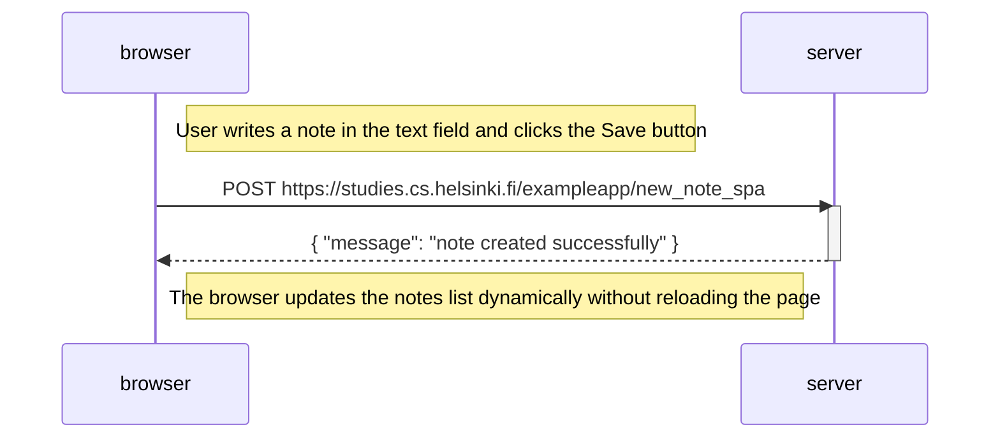

```mermaid
sequenceDiagram
    participant browser
    participant server

    Note right of browser: User writes a note in the text field and clicks the Save button

    browser->>server: POST https://studies.cs.helsinki.fi/exampleapp/new_note_spa
    activate server
    server-->>browser: { "message": "note created successfully" }
    deactivate server

    Note right of browser: The browser updates the notes list dynamically without reloading the page
```
